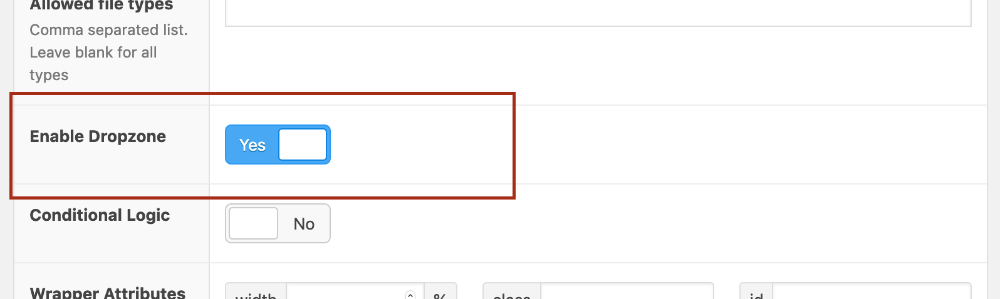
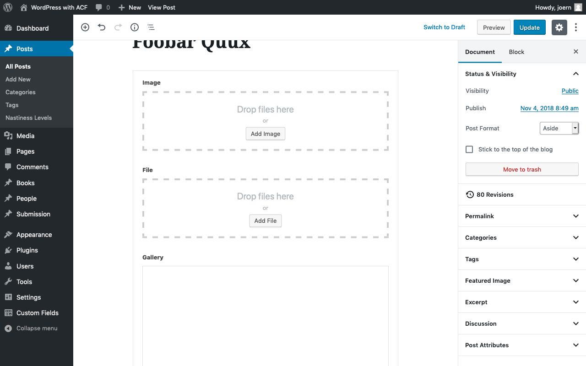

ACF Dropzone
============

This is the official github repository of the [ACF Dropzone](https://wordpress.org/plugins/acf-dropzone/) plugin.

About
-----

Add drag and drop upload to ACF File Field, Image field and Gallery field.

Requires at least WP 5.0 and ACF 5.6.

Usage
-----
Enable the "Dropzone" option in the field settings.



Enjoy your new dropping experience!




Installation
------------

### Production

#### In WP Admin
Just follow the [Automatic Plugin Installation](https://wordpress.org/support/article/managing-plugins/#automatic-plugin-installation) procedere.

#### WP-CLI
```
$ wp plugin install --activate acf-dropzone
```

#### Using composer
```
composer require mcguffin/acf-dropzone
```

### Development
 - cd into your plugin directory
 - $ `git clone git@github.com:mcguffin/acf-dropzone.git`
 - $ `cd acf-dropzone`
 - $ `npm install`
 - $ `npm run dev`
