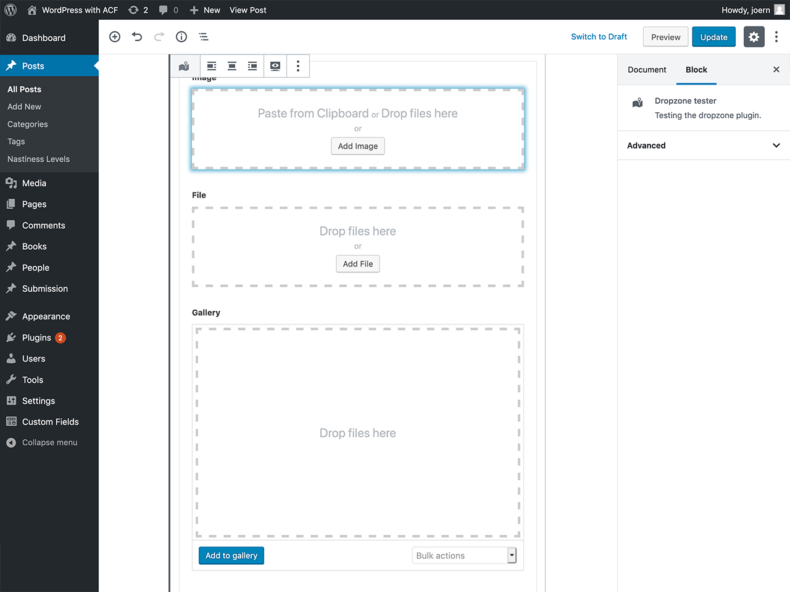

ACF Dropzone
============

This is the official github repository of the [ACF Dropzone](https://wordpress.org/plugins/acf-dropzone/) plugin.

About
-----

Add drag and drop upload to ACF File Field, Image field and Gallery field.

Requires at least WP 5.0 and ACF 5.6.

Usage
-----
Enable the "Dropzone" option in the field settings.

Enjoy your new dropping experience!

Installation
------------

### Production

In wp-admin go to *Plugins* > *Add new*. Search for `acf-dropzone`.

### Development
 - cd into your plugin directory
 - $ `git clone git@github.com:mcguffin/acf-dropzone.git`
 - $ `cd acf-dropzone`
 - $ `npm install`
 - $ `npm run dev`
